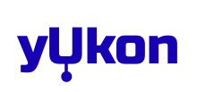

**This is currently an INCOMPLETE WORK.**

An open suite of tools for observing, debugging, and interacting with a `UAVCAN`_ v1 bus.

+--------------------------------+-----------------------------------+
| tox build (master)             | |badge_build|_                    |
+--------------------------------+-----------------------------------+
| static analysis                | |badge_analysis|_ |badge_issues|_ |
+--------------------------------+-----------------------------------+
| unit test code coverage        | |badge_coverage|_                 |
+--------------------------------+-----------------------------------+
| documentation                  | |badge_docs|_                     |
+--------------------------------+-----------------------------------+
| license                        | |badge_github_license|_           |
+--------------------------------+-----------------------------------+
| community/support              | |badge_forum|_                    |
+--------------------------------+-----------------------------------+

************************************************
Installation & Development Instructions
************************************************

Requirements:

- Python 3.7+ with pip and optional virtualenv
- NodeJS 12.16+ with optional yarn 1.22+

Install dependencies for Frontend::

    cd src/yukon/frontend
    npm install

Run server with hot code reload::

    npm run dev

Build assets for production environment with optimizations::

    npm run build

In the second terminal window install backend dependencies::

    cd src/yukon/backend
    git submodule update --init --recursive
    pip3 install -r requirements.txt

If you want to run Yukon demo node::

    python src/uavcan_node_demo.py

Run backend::

    python src/api/main.py

Install documentation and testing dependencies::

    npm install mocha
    npm install jsdoc
    pip3 install sphinx sphinx-argparse sphinx-js sphinx_rtd_theme

************************************************
Discussion
************************************************

Discussion takes part at the official `UAVCAN forum`_, specifically at `Yukon UI & Rest API`_ and `GUI Tool - Next Generation`_ forum threads.

************************************************
Backend Swagger Documentation
************************************************

- `Swaggerhub Api Docs Link`_

Most up to date swagger json is located at the `SWAGGERHUB` branch, under `/spec`. `swagger.json`_

.. _`UAVCAN`: http://uavcan.org
.. _`UAVCAN forum`:  https://forum.uavcan.org
.. _`Yukon UI & Rest API`: https://forum.uavcan.org/t/yukon-ui-rest-api/390/1
.. _`GUI Tool - Next Generation`: https://forum.uavcan.org/t/gui-tool-next-generation/229
.. _`Swaggerhub Api Docs Link`: https://app.swaggerhub.com/apis-docs/Zarkopafilis/Yukon/1.0.0
.. _`swagger.json`: https://github.com/UAVCAN/Yukon/blob/SWAGGERHUB/spec/swagger.json

.. |badge_build| image:: https://badge.buildkite.com/98867229c03fc1c66c05cfc9ecc1c29f597c7778957f53ac07.svg
    :alt: Build status
.. _badge_build: https://buildkite.com/uavcan/yukon-release

.. |badge_analysis| image:: https://sonarcloud.io/api/project_badges/measure?project=UAVCAN_Yukon&metric=alert_status
    :alt: Sonarcloud Quality Gate
.. _badge_analysis: https://sonarcloud.io/dashboard?id=UAVCAN_Yukon

.. |badge_issues| image:: https://sonarcloud.io/api/project_badges/measure?project=UAVCAN_Yukon&metric=bugs
    :alt: Sonarcloud bugs
.. _badge_issues: https://sonarcloud.io/dashboard?id=UAVCAN_Yukon

.. |badge_coverage| image:: https://sonarcloud.io/api/project_badges/measure?project=UAVCAN_Yukon&metric=coverage
    :alt: Sonarcloud coverage
.. _badge_coverage: https://sonarcloud.io/dashboard?id=UAVCAN_Yukon

.. |badge_docs| image:: https://readthedocs.org/projects/yukon/badge/?version=latest
    :alt: Documentation Status
.. _badge_docs: https://yukon.readthedocs.io/en/latest/?badge=latest

.. |badge_github_license| image:: https://img.shields.io/badge/license-MIT-blue.svg
    :alt: MIT license
.. _badge_github_license: https://github.com/UAVCAN/Yukon/blob/master/LICENSE.md

.. |badge_forum| image:: https://img.shields.io/discourse/https/forum.uavcan.org/users.svg
    :alt: UAVCAN forum
.. _badge_forum: https://forum.uavcan.org
