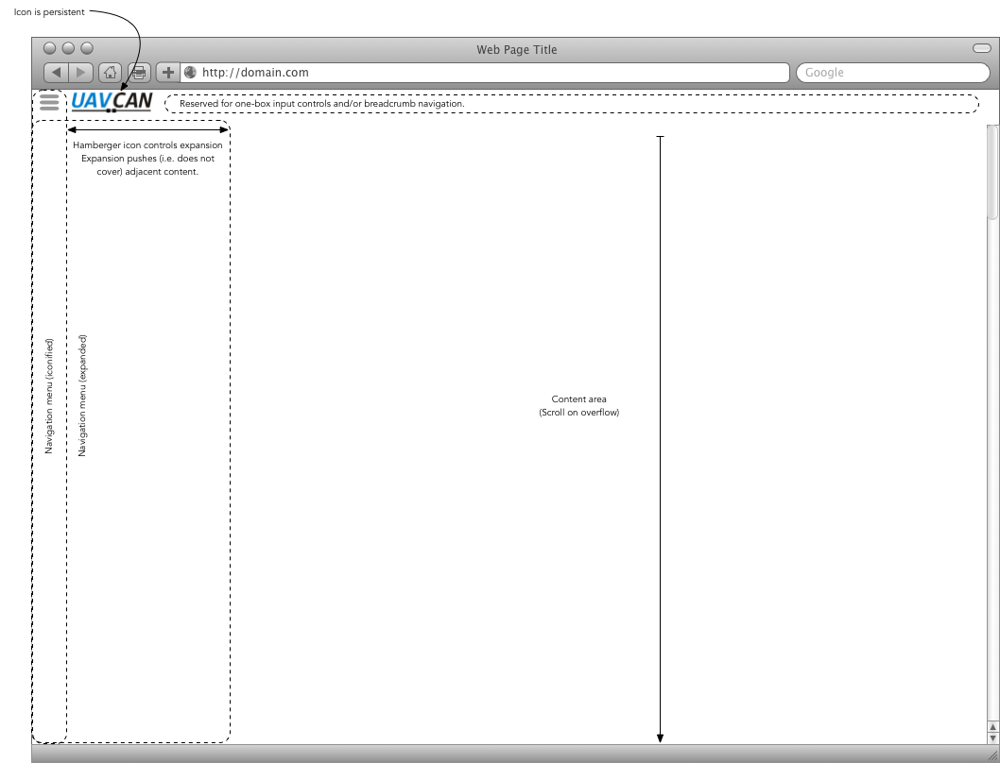

# Yukon Design

## Information design

Figure 1.0 - Primary functions of the user interface and basic taxonomy.

## UI Wireframes 

The main screen of the Yukon application is a single, responsive HTML document from which all functions are presented. This page shall adapt its presentation to be usable on a range of screens from high-resolution, hi-density to hand-held, touch screens.

Figure 2.0 - Areas of the main screen.

### General Layout

The main document consists of three regions:

1. **Logo and Title area** – For a typical desktop presentation this is located at the top of the window. Any one-box navigation control and/or breadcrumb navigation will be located in this area. This region is always visible although some presentations may choose to iconify/minimize the controls on page scroll.
2. **Navigation Area** – The navigation area should be used to control the content area and provide any functions that are pure links (e.g. "open website", "about", etc). It shall never obscure the content of any other area.
3. **Content Area** – All other functions are contained within this area. 